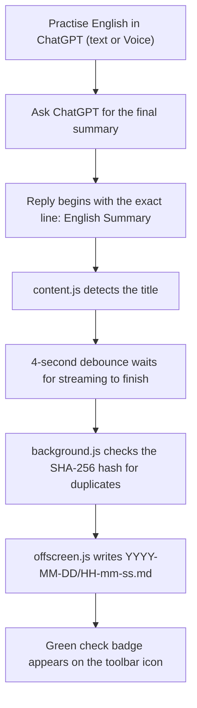

<div align="center">

# English Summary Saver

**A Chrome / Edge extension that watches ChatGPT and saves a reply to your computer — but only when its first visible line is exactly `English Summary`.**

[](https://developer.chrome.com/docs/extensions/develop/migrate)
[](https://www.google.com/chrome/)
[](https://www.microsoft.com/edge)
[](#development)
[](#privacy-and-security)
[](#privacy-and-security)

</div>

---

## Overview

You practise English in ChatGPT, ask for a summary at the end, and this extension quietly files that summary away on your own machine — organised by date, ready to review later.

It is intentionally narrow in what it does:

| It does | It does **not** |
| --- | --- |
| Run only on `https://chatgpt.com/*` | Run on any other site |
| Detect an assistant reply **only** when its first non-empty visible line is exactly `English Summary` | Save ordinary replies or whole conversations |
| Wait until the reply stops changing (streaming finished) | Save a half-written response |
| Save the complete visible reply, unchanged | Rewrite, translate, summarise, or "improve" the text |
| Organise files into local `YYYY-MM-DD` folders | Use a second AI model or the OpenAI API |
| Write through the browser's File System Access API | Use a backend server or a remote database |
| Keep every saved file on your computer | Upload anything anywhere |

There is no account, no API key, and nothing to run in a terminal after installation.

---

## Demo workflow

```text
English practice in ChatGPT
→ GPT generates "English Summary"
→ Extension detects it
→ Waits for streaming to finish
→ Saves it locally
```



---

## Features

| Feature | What it actually does |
| --- | --- |
| 🎯 **Exact-title detection** | Saves only when the first non-empty visible line, trimmed, equals `English Summary`. Case-sensitive and hard-coded. |
| ⏳ **Streaming-safe debounce** | Waits 4 seconds after the last text change; if ChatGPT still looks like it is generating, it re-checks every 1.5 s. |
| 💾 **Automatic Markdown saving** | Writes the reply as a UTF-8 `.md` file with no rewriting of the content. |
| 📅 **Date-based organisation** | Creates a `YYYY-MM-DD` folder from your **local** date; the file is named `HH-mm-ss.md`. |
| 🔁 **Duplicate prevention** | SHA-256 of `conversation URL + reply text`; the hash is recorded only after a confirmed write. The last 500 hashes are kept. |
| 📁 **Local filesystem access** | Uses the File System Access API with a folder you pick yourself. |
| 🔐 **Folder permission restoration** | One button re-requests write permission after a browser restart. |
| ♻️ **Retry latest summary** | The most recent unsaved summary is kept so you can save it after fixing permission. |
| 🧪 **Test save** | Writes and immediately deletes a temporary file to prove the folder is writable. |
| 🎚️ **Enable / disable automatic saving** | Turn detection-driven saving off; summaries are still queued for manual retry. |
| 📊 **Status and error display** | Last saved time, last filename, total saved count, and the last error — plus a green `✓` / red `!` toolbar badge. |
| 🧩 **Chrome & Edge, Manifest V3** | Service worker + offscreen document, no deprecated background page. |
| 🈶 **UTF-8 Chinese and English** | Mixed-language summaries are written correctly. |

Existing files are never overwritten — a numeric suffix is added instead (`17-35-20-2.md`).

---

## Example

A ChatGPT reply like this is saved:

```text
English Summary

1. Key Vocabulary

- tongs — 夹子
- garlic chives — 韭菜

2. Useful Sentences

She looks like she's enjoying the food.

她看起来很享受这些食物。
```

And your chosen folder fills up like this:

```text
selected-save-folder/
├── 2026-07-26/
│   ├── 17-35-20.md
│   └── 21-10-05.md
└── 2026-07-27/
    └── 15-20-10.md
```

The text is a faithful plain-text rendering of what you saw: headings and paragraphs on their own lines, list items prefixed with `-` (or `1.`, `2.` for numbered lists), table rows joined with `|`, blank lines between blocks. Interface elements (copy, rate, read-aloud buttons) are never included.

---

## Installation

The extension is loaded manually as an unpacked extension. It is **not** on the Chrome Web Store.

**1. Get the code**

Download the repository as a ZIP and extract it, or clone it:

```bash
git clone <repository-url>
```

**2. Open the extensions page**

| Browser | Address |
| --- | --- |
| Chrome | `chrome://extensions` |
| Edge | `edge://extensions` |

**3. Enable Developer Mode** — the toggle is top-right in Chrome, bottom-left in Edge.

**4. Click `Load unpacked`.**

**5. Select the extension source folder**

> [!IMPORTANT]
> Select the folder that **directly contains `manifest.json`** — the `extension` folder, not the repository root.

The card **English Summary Saver** should appear with no errors.

**6. Pin the extension** — click the puzzle-piece icon in the toolbar, then the pin next to *English Summary Saver*.

**7. Open the popup** by clicking the pinned icon.

**8. Choose a save folder** — click **Choose Save Folder** and pick where your summaries should live, then click **Allow / Edit files** in the browser prompt.

> [!WARNING]
> Pick a normal folder you own, such as `Documents/english-summaries`.
> Do **not** pick the `extension` folder, and do not create the date sub-folders yourself — they are created automatically inside the folder you choose.

**9. Restore permission if required** — if the **Permission** row does not read `granted`, click **Restore Folder Permission**.

**10. Run Test Save** — you should see `Test save succeeded – folder is writable.` It writes a tiny temporary file, deletes it again, and leaves today's date folder behind.

**11. Refresh any ChatGPT tabs** that were already open, so the content script loads into them.

---

## Usage

1. Practise English in ChatGPT, using text or Voice.
2. When you are done, ask ChatGPT to produce the final summary.
3. Make sure the first visible line of the reply is exactly:

   ```text
   English Summary
   ```

4. Wait a few seconds after the reply finishes.
5. The file is saved automatically and a green `✓` badge appears on the extension icon.

### Capitalisation matters

The comparison is exact and case-sensitive. **None** of these trigger a save:

```text
english summary
English Practice Summary
Daily Summary
Here is your English summary.
```

A Markdown heading is fine (`# English Summary`) as long as the *rendered* first line is still exactly `English Summary`.

### Suggested ChatGPT instruction

Add this to your custom instructions or paste it into the chat:

```text
When I ask for a summary, always make the first line exactly: English Summary
```

### Voice sessions

Voice works because ChatGPT still displays its reply as text in the conversation. The extension reads that displayed text — it never touches audio.

---

## Popup controls

| Control | Purpose | When to use |
| --- | --- | --- |
| **Choose Save Folder** | Select the local output folder | First setup or changing folders |
| **Restore Folder Permission** | Restore browser write permission | When permission shows `needs restore` |
| **Test Save** | Test filesystem access | Initial setup or troubleshooting |
| **Retry Latest Summary** | Retry a summary that could not be saved | After restoring permission |
| **Enable automatic saving** | Enable or disable detection-driven saving | Normally keep enabled |

The popup also shows the current save folder, the permission badge (`granted` / `needs restore` / `denied` / `no folder`), the last saved time and filename, the total number of saved summaries, and the last error.

---

## How it works

```text
chatgpt.com tab                 extension                      your disk
┌────────────┐  SUMMARY_    ┌──────────────┐  cmd: SAVE   ┌──────────────┐
│ content.js │ ──DETECTED──▶│ background.js│ ────────────▶│ offscreen.js │──▶ .md
│ MutationOb.│              │ SHA-256 dedup│              │ File System  │
└────────────┘              └──────────────┘              │ Access API   │
                                   ▲                      └──────────────┘
                              GET_STATUS │                       ▲
                            ┌────────────┴─┐  IndexedDB handle   │
                            │  popup.js    │─────────────────────┘
                            └──────────────┘
```

1. **Content script** — `content.js` is injected into `https://chatgpt.com/*` at `document_idle`. All ChatGPT DOM knowledge lives in one `SELECTORS` object at the top of the file, anchored on `[data-message-author-role="assistant"]`.
2. **`MutationObserver`** — watches the page subtree for `childList` and `characterData` changes and queues a throttled scan (250 ms) instead of reacting to every mutation.
3. **Four-second debounce** — a candidate message is finalised only after 4 s with no text change. If a streaming indicator (such as the Stop button) is still present, it waits another 1.5 s and re-checks. The title is re-confirmed at the moment of saving.
4. **Manifest V3 service worker** — `background.js` runs as an ES module service worker. It never touches the filesystem itself.
5. **Message passing** — `content → background` sends `SUMMARY_DETECTED`; `popup → background` sends `GET_STATUS`, `RETRY_LATEST`, `TEST_SAVE`, `SET_AUTOSAVE`; `background → offscreen` sends `{ target: "offscreen", cmd: "SAVE" | "TEST" }`.
6. **Offscreen document** — a service worker cannot reliably use the File System Access API, so `offscreen.html` is created on demand (reason: `BLOBS`) as a hidden document that performs the writes.
7. **File System Access API** — `offscreen.js` creates the `YYYY-MM-DD` directory, finds a non-clashing `HH-mm-ss.md` name, and writes a UTF-8 blob.
8. **IndexedDB directory handle** — a `FileSystemDirectoryHandle` is a live object and cannot be JSON-serialised, so `storage.js` keeps it in IndexedDB (database `english-summary-saver`, store `handles`).
9. **`chrome.storage.local`** — holds settings, status, the latest unsaved summary, and the duplicate-hash list.
10. **SHA-256 duplicate detection** — `background.js` hashes `conversation URL + reply text` via `crypto.subtle`, checks before saving, and records the hash only after a confirmed successful write.

### File responsibilities

| File | Responsibility |
| --- | --- |
| `manifest.json` | Extension registration and permissions |
| `content.js` | ChatGPT detection and text extraction |
| `background.js` | Coordination, deduplication, status |
| `popup.*` | User controls and permission management |
| `storage.js` | IndexedDB and extension storage helpers |
| `offscreen.*` | Local file writing |

---

## Privacy and security

- **No conversation is sent to an external server.** The extension makes no network requests at all — no `fetch`, no `XMLHttpRequest`. Text travels only between the content script, the service worker, and the offscreen document.
- **No OpenAI API key is required.** No AI model is called at any point; the reply is copied as displayed.
- **No backend and no server-side database.** The only storage is on your machine: `chrome.storage.local` for settings and hashes, and IndexedDB for the folder handle.
- **Only matching assistant summaries are saved.** Your prompts, other replies, and the rest of the conversation are never written anywhere.
- **Folder access requires explicit user permission.** The folder picker only opens from a click in the popup, and the browser must grant read/write permission before anything is written.
- **The extension runs only on the configured ChatGPT host.** `host_permissions` and the content-script match pattern are both limited to `https://chatgpt.com/*`.
- **All summaries stay on your computer** in the folder you chose. Nothing is uploaded, synced, or shared.

Requested permissions are just `storage` and `offscreen` — there is no `downloads`, `tabs`, or `<all_urls>` permission.

---

## Troubleshooting

<details>
<summary><strong>Permission shows <code>needs restore</code></strong></summary>

Browsers may forget folder permission after a restart. Open the popup and click **Restore Folder Permission**, then confirm the browser prompt. If that does not work, click **Choose Save Folder** and select the same folder again — your saved history and duplicate protection are kept.

While permission is missing the extension does **not** fall back to Downloads and does **not** mark the summary as saved.
</details>

<details>
<summary><strong>A summary was detected but not saved</strong></summary>

Open the popup and read the **Last error** box. The usual causes are:

- `Folder permission is not granted` → click **Restore Folder Permission**, then **Retry Latest Summary**.
- `No save folder is selected yet` → click **Choose Save Folder**.
- **Enable automatic saving** is switched off → the summary is queued; click **Retry Latest Summary**.
</details>

<details>
<summary><strong><code>Retry Latest Summary</code> is disabled</strong></summary>

The button is enabled only when a detected summary is actually waiting. It is disabled when nothing has been detected yet, or when the last detection was already saved successfully. Trigger a new summary in ChatGPT and the button becomes available if the save fails.
</details>

<details>
<summary><strong>No file appears in the folder</strong></summary>

1. Check that you are looking inside the correct date sub-folder (`YYYY-MM-DD`, local date).
2. Run **Test Save** — if it fails, the problem is folder permission, not detection.
3. Confirm the reply's first visible line is exactly `English Summary`.
4. Make sure the ChatGPT tab was refreshed after the extension was installed or reloaded.
</details>

<details>
<summary><strong>The title does not match exactly</strong></summary>

The check is `firstNonEmptyLine.trim() === "English Summary"` — case-sensitive, no extra words, no trailing punctuation. `english summary`, `English Practice Summary`, `Daily Summary`, and `Here is your English summary.` are all ignored by design, so ordinary replies are never saved. The title is hard-coded and not configurable.
</details>

<details>
<summary><strong>ChatGPT was open before installing the extension</strong></summary>

Content scripts are injected when a page loads. Refresh every open `chatgpt.com` tab after installing or reloading the extension.
</details>

<details>
<summary><strong>Detection stopped after a ChatGPT UI update</strong></summary>

ChatGPT's HTML can change. All selector logic is kept in the single `SELECTORS` object at the top of `content.js`, so an update usually means editing that one block. The main anchor is `[data-message-author-role="assistant"]`; completion relies on the debounce rather than one fragile Stop-button selector.
</details>

<details>
<summary><strong>A duplicate summary was intentionally ignored</strong></summary>

If the popup reports *"That summary was already saved"*, the SHA-256 of `conversation URL + reply text` matched an earlier save. Reloading ChatGPT or restarting the browser therefore never creates a second copy of the same summary.
</details>

<details>
<summary><strong>The service worker shows <code>inactive</code></strong></summary>

This is normal. A Manifest V3 service worker is event-driven: Chrome stops it when idle and starts it again when a message arrives. `inactive` means "sleeping", not "broken". Click **service worker** on the extensions page to wake it and open its console.
</details>

---

## Browser limitations

- Browsers require explicit user permission before an extension may write into a local folder — the picker cannot be opened without a click.
- Folder permission may need to be restored after restarting the browser or reloading the extension. That is a browser security rule, not a bug.
- The extension depends on ChatGPT's rendered DOM; a redesign may require selector updates in `content.js`.
- It reads **displayed text**, never audio. Voice sessions work only because ChatGPT also prints the reply as text.
- The File System Access API (`showDirectoryPicker`) is required. On a browser without it the popup reports that saving is unsupported.
- The extension is loaded manually as an unpacked extension; it is not published to any extension store.

---

## Development

No dependencies, no build step — it is plain ES modules loaded directly by the browser.

1. Edit the source files directly.
2. Open `chrome://extensions` / `edge://extensions` and click the **Reload** icon on the extension card.
3. Refresh any open `chatgpt.com` tab so the new `content.js` is injected.

Where to look when something breaks:

| Area | Where to inspect |
| --- | --- |
| Content script | DevTools console on the `chatgpt.com` page |
| Service worker | Extensions page → **service worker** link under the extension |
| Offscreen document | Extensions page → *Inspect views* → `offscreen.html` (visible while it is alive) |
| Popup | Right-click the popup → **Inspect** |
| Manifest / load errors | The **Errors** button on the extension card |

---

## Project structure

```text
extension/
├── manifest.json     # MV3 manifest, permissions, content-script registration
├── content.js        # ChatGPT detection, debounce, visible-text extraction
├── background.js     # Service worker: dedup hashing, status, badge, routing
├── offscreen.html    # Hidden document that hosts the file-writing code
├── offscreen.js      # File System Access API writes
├── popup.html        # Popup markup
├── popup.css         # Popup styles (light and dark)
├── popup.js          # Folder picker, permission, status, actions
├── storage.js        # IndexedDB directory-handle + chrome.storage helpers
└── README.md         # This file
```

---

<div align="center">

Built to turn everyday English practice into an organised local review archive —
one dated Markdown file at a time.

</div>
